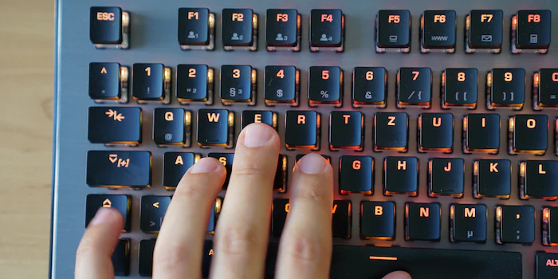
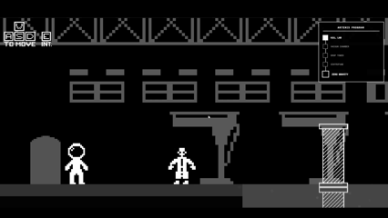
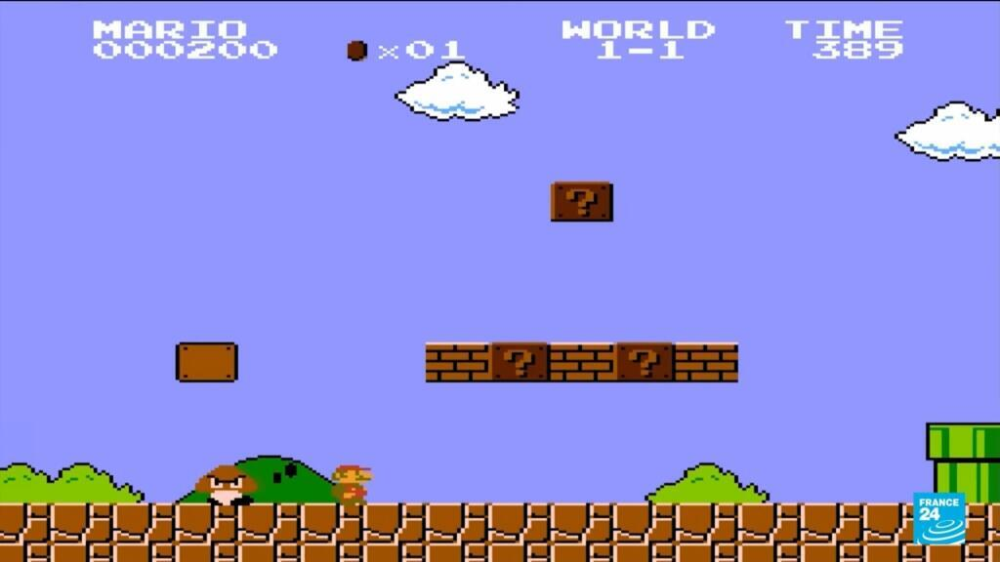

SUPSI 2026  
Corso d’interaction design, CV429.01  
Docenti: A. Gysin, G. Profeta  

Progetto 1: La conquista dello spazio

# Project Moonbound
Autore: Riccardo Vosti \
[Project Moonbound](https://riccardovosti.github.io/projectmoonbound/)


## Introduzione e tema
Questo progetto è un'avventura web interattiva in pixel-art dedicata al Programma Artemis della NASA. È un omaggio all'esplorazione spaziale che mette l'utente al centro dell'azione, trasformandolo in una recluta pronta per il ritorno dell'umanità sulla Luna.
Il gioco è un vero e proprio simulatore di addestramento astronautico. Sotto la guida del Dr. Aris, il giocatore deve affrontare e superare un percorso in sei fasi basato sui reali test della NASA.


## Riferimenti progettuali
**Micro-Tasking (es. *Google Doodles*, *Among Us*):** Gameplay diviso in minigiochi rapidi. Abbassa il carico cognitivo e traduce la teoria aerospaziale in pratica immediata (*learning by doing*).

**Pixel-Art Funzionale:** Estetica retro anni '90 scelta non solo per fascino visivo, ma per semplificare ambienti immensi (come la piscina N.B.L.) e garantire prestazioni web istantanee.

**Reward System (Museo Virtuale):** Il videogioco funge da "esca". La vera ricompensa al termine della sfida è lo sblocco di un archivio interattivo con i reali filmati storici della NASA.

[]()


## Design dell’interfaccia e modalità di interazione
**Interfaccia Visiva (UI)**
- **Terminale Sci-Fi:** Stile minimalista (bianco su nero, font pixel-art) ispirato ai monitor di controllo della NASA.
- **Zero Distrazioni:** Layout pulito. Una *stepper bar* laterale mostra sempre i progressi e i livelli rimanenti senza ingombrare la visuale.

**Interazione (UX)**
- **Comandi Familiari:** Controlli standard del gaming PC (`WASD`, `Spazio`, `E`) per azzerare la curva di apprendimento.
- **Proximity Prompts:** I comandi a schermo (es. `[E] PARLA`) appaiono in automatico solo quando il giocatore è vicino a un oggetto interattivo.
- **Micro-Learning:** Le spiegazioni scientifiche evitano i "muri di testo". La teoria è divisa in brevi frasi passate tramite finestre di dialogo con l'NPC del gioco (Dr. Aris).


[]()

[]()


## Tecnologia usata
**Phaser 3 (Arcade Physics):** Il vero motore del progetto. Ho utilizzato questa potente libreria JavaScript per gestire il *core loop* del gioco, la fisica 2D (gravità, collisioni, bounding box), il rendering degli sprite in pixel-art, le animazioni e la gestione della camera dinamica.

**HTML5 & CSS3:** Utilizzati per strutturare e stilizzare tutta l'interfaccia utente (HUD), i menu di navigazione, i popup modali e le finestre di dialogo. Le transizioni fluide e le cinematiche (come il testo a scorrimento e il decollo dell'astronave) sono realizzate interamente tramite animazioni CSS (keyframes).

**JavaScript :** Sfruttato per manipolare il DOM in tempo reale, gestire la logica dei quiz e coordinare il passaggio di stato tra i vari livelli. 

**Web Storage API (localStorage e la sessionStorage):** Fondamentali per la *data persistence*. Permettono di salvare il nome dell'utente, calcolare il timer globale tra le diverse pagine HTML e gestire la continuità della colonna sonora (evitando che la musica riparta da zero ad ogni cambio livello).

**HTML5 Canvas API:** Utilizzata nativamente (al di fuori di Phaser) nelle schermate di transizione per generare sistemi particellari leggeri e performanti (come lo sfondo stellato e le fiamme dei motori).

**HTML Audio API:** Per la gestione dinamica degli effetti sonori spaziali e della musica di background, con logiche anti-blocco per le policy di autoplay dei browser moderni.


```JavaScript
function triggerMainDialogue() {
    startDialogue([
        `Stop right there, ${playerName.toUpperCase()}! Be careful not to fall into the tank yet.`,
        `Welcome to the N.B.L., the Neutral Buoyancy Lab.`,
        `This massive pool is 12 meters deep and filled with ultra-purified water.`,
        `Here we simulate Extravehicular Activities (EVA) or spacewalks. The water mimics the feeling of weightlessness.`,
        `But beware: your suit is incredibly heavy! If you stop moving, you'll sink to the bottom.`,
        `Dive in, navigate around the white modules, and repeatedly press [SPACE] or [W] to swim upward.`,
        `Swim to the other side to complete the test.`
    ], () => { hasTalkedToScientist = true; });
}
```


## Target e contesto d’uso
**Target: Studenti delle Scuole Medie (11-14 anni)**
Ho scelto questa fascia d'età perché concetti complessi come la microgravità o l'attrito aerodinamico risultano spesso troppo astratti se affrontati solo sui libri. Trattandosi di nativi digitali, la *gamification* è il linguaggio più diretto per mantenere alta la loro attenzione e tradurre la teoria in pratica.

**Contesto d'Uso: Edutainment**
L'app è *browser-based* (nessuna installazione richiesta) e si presta a diversi scenari:
- **In classe:** Come supporto interattivo per i docenti durante le lezioni di scienze.
- **A casa:** Per trasformare lo studio autonomo in una sfida gratificante.
- **Eventi STEM:** Come *exhibit* digitale per incuriosire i ragazzi durante open-day o fiere scientifiche.


[]()